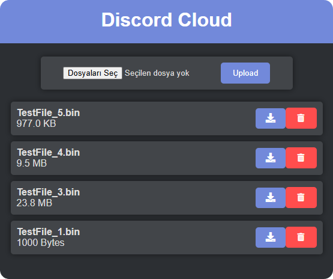

# discord-cloud

Simple web application to use discord channels as free cloud storage.



## Built With

* 
* 
* 
* 

## Installation

1. Clone the repo
   ```sh
   git clone https://github.com/lilmirac/discord-cloud.git
   ```
2. Navigate to the project directory
   ```sh
   cd discord-cloud
   ```
3. Enter variables in `.env` file

`BOT_TOKEN="Discord Bot Token"`

`SERVER_ID="ID of server"`

`CHANNEL_ID="ID of channel"`

4. Set up project manually or using docker

    ```sh
   pip install -r requirements.txt
   python main.py
   ```
    ```sh
   docker build -t discord-cloud .
   docker run discord-cloud
   ```

## Usage
* After installation steps you can navigate to `localhost:8000` in your web browser
* You can manage, download, delete existing files, upload new (Up to 25MB / file for now) files
* You can use VPN services for using this service on your other devices

## Contact
Miraç - [contact@mirac.dev](mailto:contact@mirac.dev?subject=[GitHub])

[](https://mirac.dev)
## License
Distributed under the MIT License. See [License](https://github.com/lilmirac/discord-cloud/blob/main/LICENSE) for more information.

